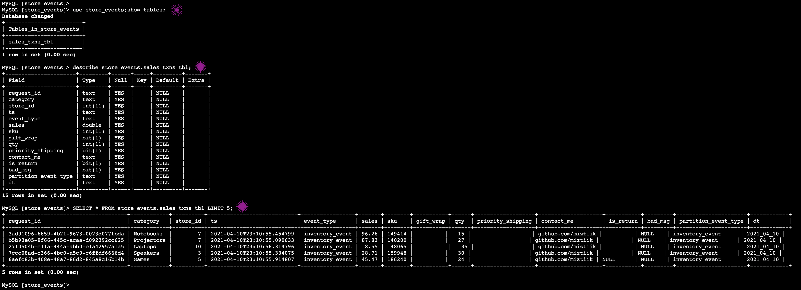

# Extract, Transform, and Load data for analytic processing using Glue

The developers at Mystique Unicorn are exploring the option of building a OLTP <sup>[1]</sup> database in AWS using RDS. They have batches of `JSON` data arriving to their S3 bucket at frequent intervals. They would like a mechanism to ingest this data to RDS. New data is added to S3 on a daily schedule. This mechanism should be able to perform the data load incrementally.

Can you help them to process incoming events and process the incoming events from `JSON` format to `parquet` and store them in S3 to allow them to query with Athena.

## 🎯 Solutions

AWS Glue is a fully managed serverless data integration service that makes it easy to extract, transform, and load (ETL) from various data sources for analytics and data processing with Apache Spark ETL jobs. In this application, we will fetch the incoming events from S3(_generated by lambda_) and process them using Glue Jobs and load them to RDS database for analytics. Let us assume each store produces an event like the one shown below,

```json
{
  "request_id": "ced29fc0-860b-4c41-a661-bef4ffd158ee",
  "category": "Groceries",
  "store_id": 3,
  "ts": "2021-04-10T22:38:35.380361",
  "event_type": "inventory_event",
  "sales": 20.94,
  "sku": 31555,
  "gift_wrap": true,
  "qty": 38,
  "priority_shipping": true,
  "contact_me": "github.com/miztiik",
  "is_return": true
}
```


1.  ## 🧰 Prerequisites

    This demo, instructions, scripts and cloudformation template is designed to be run in `us-east-1`. With few modifications you can try it out in other regions as well(_Not covered here_).

    - 🛠 AWS CLI Installed & Configured - [Get help here](https://youtu.be/TPyyfmQte0U)
    - 🛠 AWS CDK Installed & Configured - [Get help here](https://www.youtube.com/watch?v=MKwxpszw0Rc)
    - 🛠 Python Packages, _Change the below commands to suit your OS, the following is written for amzn linux 2_
      - Python3 - `yum install -y python3`
      - Python Pip - `yum install -y python-pip`
      - Virtualenv - `pip3 install virtualenv`

1.  ## ⚙️ Setting up the environment

    - Get the application code

      ```bash
      git clone https://github.com/miztiik/s3-to-rds-with-glue
      cd s3-to-rds-with-glue
      ```

1.  ## 🚀 Prepare the dev environment to run AWS CDK

    We will use `cdk` to make our deployments easier. Lets go ahead and install the necessary components.

    ```bash
    # You should have npm pre-installed
    # If you DONT have cdk installed
    npm install -g aws-cdk

    # Make sure you in root directory
    python3 -m venv .venv
    source .venv/bin/activate
    pip3 install -r requirements.txt
    ```

    The very first time you deploy an AWS CDK app into an environment _(account/region)_, you’ll need to install a `bootstrap stack`, Otherwise just go ahead and deploy using `cdk deploy`.

    ```bash
    cdk bootstrap
    cdk ls
    # Follow on screen prompts
    ```

    You should see an output of the available stacks,

    ```bash
    sales-events-bkt-stack
    sales-events-producer-stack
    s3-to-rds-with-glue-vpc-stack
    oltp-consumer-on-ec2-stack
    sales-events-oltp-db-stack
    s3-to-rds-with-glue-txns-tbl-stack
    s3-to-rds-with-glue-crawler-stack
    s3-to-rds-with-glue-job-stack
    ```

1.  ## 🚀 Deploying the application

    Let us walk through each of the stacks,

    - **Stack: sales-events-bkt-stack**

      This stack will create a version controlled s3 bucket to hold all our store events.

      Initiate the deployment with the following command,

      ```bash
      cdk deploy sales-events-bkt-stack
      ```

      After successfully deploying the stack, Check the `Outputs` section of the stack. You will find the `StoreEventsBucket`.

    - **Stack: sales-events-producer-stack**

      This stack will create the lambda function that will generate the events and write them to `StoreEventsBucket` under two prefixes `sale_events` and `inventory_events`. The lambda function has a runtime of `2` seconds. If you want more events to be generated, then you can increase the duration of lambda and also run it multiple times.

      Initiate the deployment with the following command,

      ```bash
      cdk deploy sales-events-producer-stack
      ```

      After successfully deploying the stack, Check the `Outputs` section of the stack. You will find the producer `StoreOrdersEventsProducer` lambda function. We will invoke this function later during our testing phase.

    - **Stack: oltp-consumer-on-ec2-stack**

      To simulate the access of business analysts to RDS, We will use an ec2 instance. This stack will also create the vpc, subnets, route tables using the stack `s3-to-rds-with-glue-vpc-stack`. We will be using the same VPC for hosting our RDS OLTP server.

      The EC2 instance will be launched in the public subnet along with a IAM Role that supports SSM Session Manager access<sup>[2]</sup>. This Ec2 instance is configured to be bootstrapped with mysql client libraries to enable connections to RDS. Take a look at the userdata scripts at `stacks/back_end/oltp_consumer_on_ec2_stack/bootstrap_scripts/deploy_app.sh` if you want to modify them or improve them to add your own libraries.

      Initiate the deployment with the following command,

      ```bash
      cdk deploy s3-to-rds-with-glue-vpc-stack
      cdk deploy oltp-consumer-on-ec2-stack
      ```

      After successfully deploying the stack, Check the `Outputs` section of the stack. You will find the instance `Ec2ConsumerInstance`.

    - **Stack: store-events-oltp-db-stack**

      To receive the incoming events from S3, we will need a OLTP database. We will use an RDS database running MySQL engine for that. This instance will be hosted in the private subnet and the security group is configured to allow port `3306` connections from within the VPC. To enable AWS Glue to communicate between its components, a security group rule with a self-referencing inbound rule for all TCP ports is required<sup>[3]</sup>. The database is has the following configurations,

      - Database Name: `store_events`
      - DB Engine Version: `5.7.x` <sub><sup>Native Glue Connections drivers for MySQL `>8.x` seem to be buggy at this moment, hence the lower version.</sup></sub>
      - DB Username: `mystiquemaster`
      - DB Password: Auto generated and stored in AWS Secrets Manager
      - Parameter & Option Group: Defaults

      Initiate the deployment with the following command,

      ```bash
      cdk deploy store-events-oltp-db-stack
      ```

      After successfully deploying the stack, Check the `Outputs` section of the stack. You will find the DB Resource `StoreEventsDatabase`. You will find the credentials to connect to the database in secrets manager arn `StoreEventsDatabaseSecretArn`. The sample command to connect to the db a cli can also be found there.

    - **Stack: s3-to-rds-with-glue-txns-tbl-stack**

      This stack will create the Glue Catalog Database: `miztiik_sales_db`. We will use a glue crawler to create a table under this database with metadata about the store events. We will hook up this table as data source for our glue jobs later.

      _**NOTE**: This stack also create a table in glue database, we can ignore that for now. It is not used anywhere, It is a remanent and needs to be cleaned up._

      Initiate the deployment with the following command,

      ```bash
      cdk deploy s3-to-rds-with-glue-txns-tbl-stack
      ```

      After successfully deploying the stack, Check the `Outputs` section of the stack. You will find the `GlueCatalogDBForStoreEvents` resource.

    - **Stack: s3-to-rds-with-glue-crawler-stack**

      To ingest our S3 data to RDS, we need to know what columns are to be create and what are their types. We will use a crawler to populate our `StreamingETLGlueJob` Data Catalog with the discovered schema. Upon completion, the crawler creates or updates one or more tables in our data catalog. The crawler will also configured to be run on a periodic schedule to discover new data being added at our source.

      Remember the prefixes `sale_events` and `inventory_events` created by our `sales-events-producer-stack`, this will come in handy when we set our crawler to crawl these sources. If you decide to use _Parquet_ or _Athena_ you can use them to narrow down your query.

      We will also configure our crawler to exclude the prefix `bookmarks/**`, As we will configure Glue Job Bookmarks<sup>[4]</sup> to use this location to keep track of data being processed.

      The crawled data is added under a new table with the prefix `txns_` under our glue database that we created within our `s3-to-rds-with-glue-txns-tbl-stack`

      Initiate the deployment with the following command,

      ```bash
      cdk deploy s3-to-rds-with-glue-crawler-stack
      ```

      After successfully deploying the stack, Check the `Outputs` section of the stack. You will find the `SaleTransactionsCrawler` resource. Although there is a trigger scheduled, We will later trigger this manually to quicken the testing process.

    - **Stack: s3-to-rds-with-glue-job-stack**

      All the stacks that we have deployed so far to get all prerequisites ready for data load to RDS. This stack will consum inputs from these stacsk and does ingestion of data from S3 to RDS. We need to supply a script that does the data ingestion to JDBC Datastore. As I am not much familiar with Spark scripts, I used the Glue console to generate the script for me. The code is provided to you in this location `stacks/back_end/glue_stacks/glue_job_scripts/load_json_to_rds.py`.

      To connect to our RDS/JDBC data store, we need a Glue connection<sup>[5]</sup> that stores connection information like login credentials, URI strings, virtual private cloud (VPC) information, and etc. At the moment of writing this demo, there is no easy way to securely provide the database password in clouformation while create a glue connection. To avoid hardcoding db password in Cfn, I have decided to provision it with a dummy password. Later we will update it from the console, you can also do the same with Cfn Custom Resource/CLI/SDK etc. _No easy way out here_

      I have parameterized the script so that we can pass in the database, table and bucket name as glue job parameters. Notice the secret arn, we will use the Glue Job environment to safely access the credentials from secrets manager.

      - `src_db_name` : This will be our `GlueCatalogDBForStoreEvents`
      - `src_etl_bkt` : This will be our `StoreEventsBucket`
      - `crawler_tbl_prefix` : This will be `txns_`
      - `tgt_db_secret_arn`: This will be `StoreEventsDatabaseSecretArn`
      - `tgt_tbl_name`: At this moment, we will use the same name as our crawler create table name.
      - `conn_name`: The Glue connection for MySQL5.7 will be created by the stack and passed on as a parameter. _Remember the caveat, about RDS versions when deploying OLTP DB stack_

      As this will be doing very small batch uploads, the Glue job `timeout` is set for 2 minutes. We will also set up job to consume `2 DPU`. As a learning attempt on how to setup job triggers, I have also set up the job to be triggered to every day at 1 in the morning. Job bookmarks will persist here `s3://<StoreEventsBucketName>/bookmarks`.

      Initiate the deployment with the following command,

      ```bash
      cdk deploy s3-to-rds-with-glue-job-stack
      ```

      After successfully deploying the stack, Check the `Outputs` section of the stack. You will find the `RDSIngestorETLGlueJob` Glue Job.

1.  ## 🔬 Testing the solution

    1.  **Invoke Producer Lambda**:
        Let us start by invoking the lambda `StoreOrdersEventsProducer` from the producer stack using the AWS Console. If you want to ingest more events, invoke the lambda few times.

        ```json
        {
          "statusCode": 200,
          "body": "{\"message\": {\"status\": true, \"tot_msgs\": 28, \"bad_msgs\": 2, \"sale_evnts\": 14, \"inventory_evnts\": 14, \"tot_sales\": 1303.87}}"
        }
        ```

        Here in this invocation, We have generated `28` messages. Within those message, we have `14` sale events and `14` are created.

        At this point, we have events coming from our producers being stored in S3. These events will be crawled by glue update our catalog.

    1.  **Invoke Glue Crawler**:

        Access AWS Glue Crawler from the console, You should be able to find `sale_txns_crawler`. Trigger the crawler
        

        After the crawler has successfully completed, if you navigate to the **Glue Database > Tables**, You will find our discovered schema along with our partitions.
        

    1.  **Configure Glue Connection**:
        We will now replace the dummy password in glue connection with the actual one from Secrets Manager.
        

        In AWS Glue > Connections > `rdsMySQL57Conn` > Edit > Next > Update Password > Next > Finish
        

    1.  **Connect To OLTP consumer ON EC2**:
        Connect to the `Ec2ConsumerInstance` instance using SSM Session Manager<sup>[2]</sup>.

        ```bash
        mysql -h ssjbd8szm8okx0.ca64q8ficuhu.us-east-1.rds.amazonaws.com -u mystiquemaster -P 3306 -p
        # Provide password from Secrets Manager
        use store_events;show tables;
        ```

        

        You can see that there are no tables under our database `store_events`.

    1.  **Invoke Glue Job**:

        Navigate to the Glue Job Console and you should find a job `s3-to-rds-ingestor`. Run the job from the actions menu. You do not have to change any parameters as they are all pre-configured.

        

        After about a minute or so, the job should complete successfully. You can check the logs in cloudwatch, if needed.

        

        Let us go back to our OLTP Consumer on EC2 and check the database again,

        ```bash
        use store_events;show tables;
        SELECT COUNT(*) FROM store_events.sales_txns_tbl;
        SELECT * FROM store_events.sales_txns_tbl LIMIT 5;
        DESCRIBE store_events.sales_txns_tbl;
        ```

        

        You can observe that there are `28` records here, same the entries generated by `StoreOrdersEventsProducer`. You can do an incremental load, by triggering the lambda followed by running the Glue Job again. You will find only the new records being added to the database.

    1.  **Check S3 Bucket**:

        Check the s3 bucket `StoreEventsBucket` for the job bookmarks under prefix `bookmarks/`.You can use S3 Select to view the contents and able to understand how many files were processed in the previous run.

1.  ## 📒 Conclusion

    Here we have demonstrated how to use Glue to load data from S3 to RDS using crawlers and spark jobs. You can extend this further by transforming the data before loading RDS.

1.  ## 🧹 CleanUp

    If you want to destroy all the resources created by the stack, Execute the below command to delete the stack, or _you can delete the stack from console as well_

    - Resources created during [Deploying The Application](#-deploying-the-application)
    - Delete CloudWatch Lambda LogGroups
    - _Any other custom resources, you have created for this demo_

    ```bash
    # Delete from cdk
    cdk destroy

    # Follow any on-screen prompts

    # Delete the CF Stack, If you used cloudformation to deploy the stack.
    aws cloudformation delete-stack \
      --stack-name "MiztiikAutomationStack" \
      --region "${AWS_REGION}"
    ```

    This is not an exhaustive list, please carry out other necessary steps as maybe applicable to your needs.

## 📌 Who is using this

This repository aims to show how to use AWS Glue for ETL processing architecture to new developers, Solution Architects & Ops Engineers in AWS. Based on that knowledge these Udemy [course #1][102], [course #2][101] helps you build complete architecture in AWS.

### 💡 Help/Suggestions or 🐛 Bugs

Thank you for your interest in contributing to our project. Whether it is a bug report, new feature, correction, or additional documentation or solutions, we greatly value feedback and contributions from our community. [Start here](/issues)

### 👋 Buy me a coffee

[](https://ko-fi.com/Q5Q41QDGK) Buy me a [coffee ☕][900].

### 📚 References

1. [Wiki: Online transaction processing][1]
1. [AWS SSM Session Manager][2]
1. [AWS Docs: Setting Up a VPC to Connect to JDBC Data Stores][3]
1. [AWS Docs: Tracking Processed Data Using Job Bookmarks][4]
1. [AWS Docs: AWS Glue Connections][5]

### 🏷️ Metadata


**Level**: 300

[1]: https://en.wikipedia.org/wiki/Online_transaction_processing
[2]: https://www.youtube.com/watch?v=-ASMtZBrx-k
[3]: https://docs.aws.amazon.com/glue/latest/dg/setup-vpc-for-glue-access.html
[4]: https://docs.aws.amazon.com/glue/latest/dg/monitor-continuations.html
[5]: https://docs.aws.amazon.com/glue/latest/dg/connection-using.html
[100]: https://www.udemy.com/course/aws-cloud-security/?referralCode=B7F1B6C78B45ADAF77A9
[101]: https://www.udemy.com/course/aws-cloud-security-proactive-way/?referralCode=71DC542AD4481309A441
[102]: https://www.udemy.com/course/aws-cloud-development-kit-from-beginner-to-professional/?referralCode=E15D7FB64E417C547579
[103]: https://www.udemy.com/course/aws-cloudformation-basics?referralCode=93AD3B1530BC871093D6
[899]: https://www.udemy.com/user/n-kumar/
[900]: https://ko-fi.com/miztiik
[901]: https://ko-fi.com/Q5Q41QDGK
